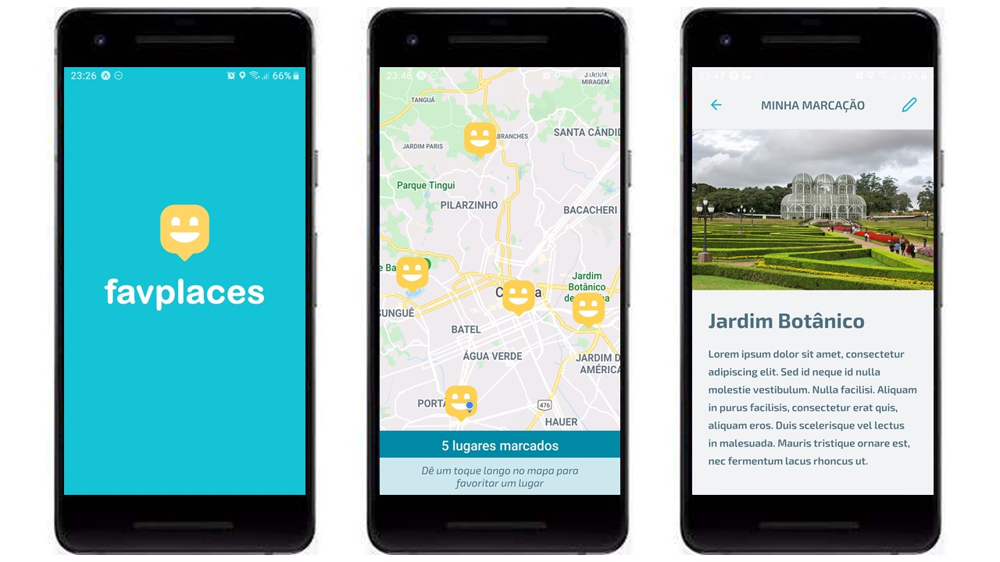

<h1 align="center">
  :world_map: FavPlaces App
</h1>

<p align="center">
  <a href="#trophy-lessons-learned">Lessons Learned</a>&nbsp;&nbsp;&nbsp;|&nbsp;&nbsp;&nbsp;
  <a href="#rocket-technologies--resources">Technologies</a>&nbsp;&nbsp;&nbsp;|&nbsp;&nbsp;&nbsp;
  <a href="#hammer-setting-up-the-environment">Environment Setup</a>
</p>

<p align="center">
  

  

  

  

  
</p>



Application developed as an assignment to college, subject Development for Mobile Devices, at UFPR, in order to learn building **React Native** applications. The project seeks to apply knowledge in functional components, React Navigation, HTTP calls, maps and user location.

The proposal was to build a simple mobile app that displays a map with markers of favorite places to the user. The user should be able to add new markers by long-pressing on the map and display the details by clicking on the marker afterwards. The data should be persisted in the server, so JSON Server was indicated to be used, as it is very easy to set a REST API up. The user should also be able to edit and delete the existing markers. Developing the capability to add photos to the places could grant extra points 😍.

## :trophy: Lessons Learned

- Configuring React Native Maps and adding markers & its callout;
- Browsing images from the device;
- Granting permission to get user's location;

## :rocket: Technologies & Resources

**Frontend:**
- React Native
- Expo Framework
- React Native Mpas
- Axios (HTTP client)

**Backend:**
- JSON Server

**Development:**
- Visual Studio Code
- NPM routines

## :hammer: Setting up the Environment

Make sure to have **Node.js 10+** installed in your machine and its **npm** available in the command line, then use the following command to install dependencies:

```bash
$ npm install
```

Before starting the development server, you need to set up the environment variables in `.env` file, at the project root. If one was not created after dependencies installation process, you can use `.env.example` as reference, so you'll know all variables available in the application. The most important one is **API_URL**, which will be the URL where your JSON Server is accessible. In my case, as I was using my own device during development, I used the local network IPV4 to my computer (e.g. "192.168.15.1").

At last, you can use the following commands to run the application:

```bash
$ npm run server   # run JSON Server to provide the REST API
$ npm start        # run Expo server to execute the app
```
